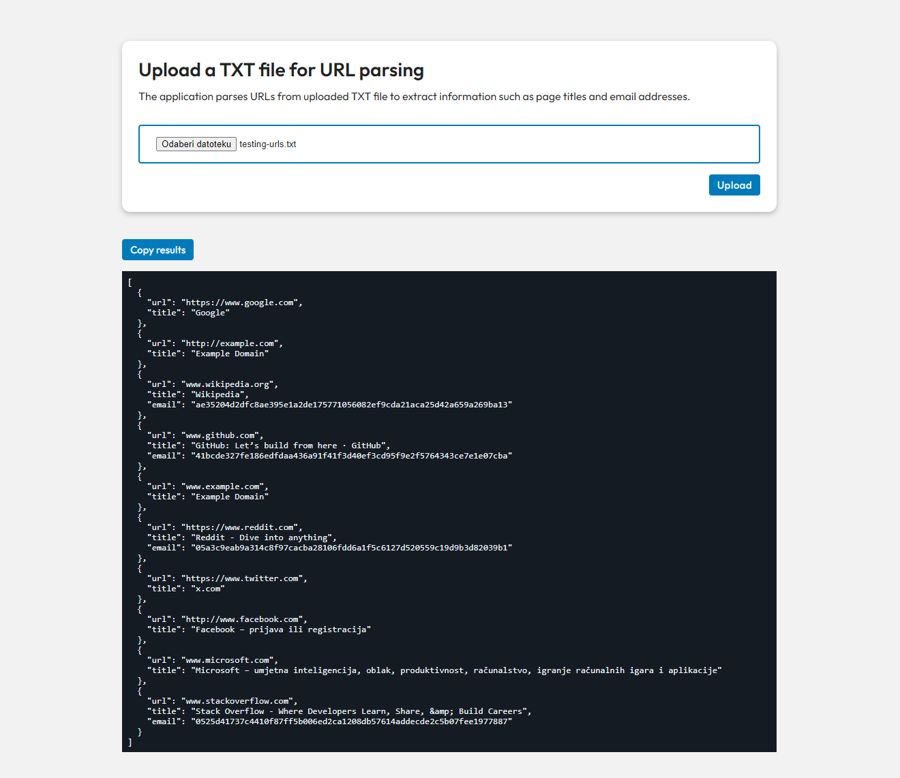

# URL Parser application

This is a Node.js-based web application that allows users to upload text files containing URLs. The application parses these URLs to extract information such as page titles and email addresses. The results are presented in a structured format, making it easy for users to view and analyze the data.



### Features

- **URL parsing**: Automatically extracts URLs from the uploaded files.
- **HTTP requests**: Makes HTTP requests to the URLs to retrieve titles and email addresses.
- **Structured output**: Returns results in a readable format.
- **Error handling**: Gracefully handles errors related to file uploads, invalid URLs and HTTP requests.
- **File upload**: Users can upload `.txt` files containing URLs.

### Technologies

- **Node.js**: JavaScript runtime for building the server.
- **Axios**: Promise-based HTTP client for making requests to URLs.
- **Crypto**: Built-in module for hashing email addresses.
- **Express.js**: Web framework for handling HTTP requests.
- **Multer**: Middleware for handling file uploads.

<hr/>

### ⚙️ Installation

1. **Clone the repository:**

   ```bash
   git clone https://github.com/mariovida/node-url-parser.git
   cd node-url-parser
   ```

2. **Install dependencies:**

   ```bash
   npm install
   ```

3. **Set up the environment:**
   Create a .env file in the root of the project:

   ```bash
   IM_SECRET=secret_key
   PORT=3000
   ERROR_LOG=true # Set to true to enable error logging in the console, false or omit to disable
   ```

💡 Errors can be displayed in the console if the environment variable `ERROR_LOG=true` is set.

<hr/>

### 🚀 Running the application

### ️1. Direct command-line usage

Place the `.txt` file (e.g., `testing_urls.txt`) in the root directory or any accessible directory and run the following command:

    node src/parser.js path/to/testing_urls.txt

The application will process the specified file and output the results directly to the console.

### ️2. Direct command-line usage

If no arguments are provided to the script (no path to the file), the application will read input from the standard input (stdin) stream. For example, you can run:

    echo "[https://example.com] [www.google.com]" | node src/parser.js

### ️3. Web usage (Extra case - added for user convenience)

1. **Start the server:**

   ```bash
   node server.js
   ```

2. **Open web browser and navigate to http://localhost:3000**

3. **Upload a `.txt` file using the web interface that contains URLs formatted like this:**

A sample file (`testing-urls.txt`) is provided in the root of the project for <b>testing purposes</b>. It contains various cases of URLs and escaped characters to help quickly test the application.

```bash
[https://www.google.com]
[http://example.com]
[www.wikipedia.org]
Valid URL with WWW: [www.github.com]

Nested URL: [Another page [www.example.com] is here]
Another nested example: [Outer text [https://www.reddit.com] Inner text]

Some random text [https://www.twitter.com] and [http://www.facebook.com] in between.
More text [www.microsoft.com] with various examples.

Case with [www.stackoverflow.com] and \[https://google.com]
Test with escaped brackets: asdf \[https://www.youtube.com]

Invalid URL: [https://thisurldoesnotexist12345.com]
```

The application will parse the uploaded file, make HTTP requests to the URLs and display the results in a structured format on the web page.
